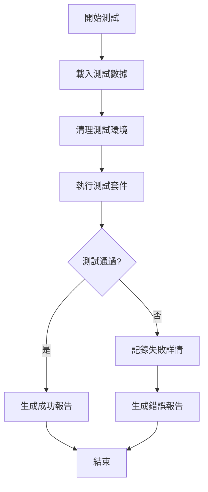

# 🧪 知音計畫測試系統

## 目錄結構

```
test/
├── README.md                 # 本文件
├── docs/
│   ├── TEST-PLAN.md         # 測試計畫
│   ├── TEST-CASES.md        # 測試案例詳述
│   └── TEST-RESULTS.md      # 測試結果記錄
├── scripts/
│   ├── test-runner.js       # 主測試執行器
│   ├── test-commission.js   # 佣金計算測試
│   ├── test-orders.js       # 訂單管理測試
│   ├── test-points.js       # 點數操作測試
│   └── test-edge-cases.js   # 邊界條件測試
├── data/
│   ├── test-partners.json   # 測試夥伴資料
│   ├── test-bookings.json   # 測試訂單資料
│   └── test-scenarios.json  # 測試場景定義
└── reports/
    └── [自動生成的測試報告]
```

## 快速開始

### 1. 執行所有測試
```bash
npm run test:all
```

### 2. 執行特定測試
```bash
npm run test:commission  # 只測試佣金計算
npm run test:orders     # 只測試訂單管理
npm run test:points     # 只測試點數操作
```

### 3. 生成測試報告
```bash
npm run test:report
```

## 測試原則

### 雙重驗證機制
每個測試都必須：
1. **前端驗證** - 檢查 UI 顯示是否正確
2. **後端驗證** - 直接查詢資料庫確認數據

### 測試覆蓋要求
- 核心業務邏輯：100%
- 金錢計算相關：100%
- 一般功能：>80%
- 邊界條件：>90%

## 測試分類

### 1. 單元測試 (Unit Tests)
- 佣金計算公式
- 等級判定邏輯
- 日期計算函數
- 數據驗證函數

### 2. 整合測試 (Integration Tests)
- 訂單創建到佣金計算流程
- 點數使用到餘額更新流程
- 等級升級連動效果
- 資料表關聯更新

### 3. 端到端測試 (E2E Tests)
- 完整訂房流程
- 完整結算流程
- 批量操作流程
- 月結年結流程

### 4. 迴歸測試 (Regression Tests)
- 已修復問題的驗證
- 版本更新後的相容性
- 歷史數據的正確性

## 測試數據管理

### 測試夥伴
- TEST_LV1_NEW: 新加入的 LV1 大使
- TEST_LV1_EXP: 即將升級的 LV1 大使
- TEST_LV2_STD: 標準 LV2 大使
- TEST_LV3_VIP: VIP LV3 大使

### 測試訂單
- 標準訂房（各種金額）
- 取消訂單
- 修改訂單
- 特殊日期訂單

## 已知問題追蹤

當發現新問題時：
1. 檢查 COMMISSION-SYSTEM-ARCHITECTURE.md 是否有定義
2. 如有缺漏，更新架構文件
3. 新增對應的測試案例
4. 更新測試腳本

## 測試執行流程



## 常見問題

### Q: 測試數據會影響正式環境嗎？
A: 不會。所有測試數據都使用 TEST_ 前綴，並在測試後清理。

### Q: 如何新增測試案例？
A: 
1. 在 TEST-CASES.md 中定義案例
2. 在相應的測試腳本中實作
3. 更新 test-scenarios.json

### Q: 測試失敗如何處理？
A:
1. 查看 reports/ 中的詳細報告
2. 確認是程式問題還是測試問題
3. 修復後重新執行測試

## 聯絡資訊

測試系統維護：知音計畫技術團隊
最後更新：2024-08-21