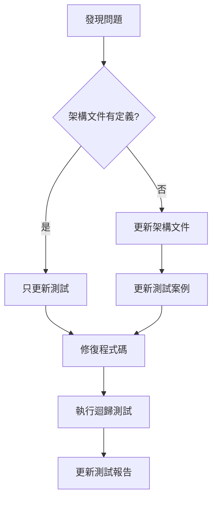

# 📋 知音計畫測試計畫

## 一、測試目標

確保知音計畫的佣金系統在以下方面達到業界標準：
1. **財務準確性** - 所有金額計算必須 100% 準確
2. **數據一致性** - 前後端數據必須完全同步
3. **業務邏輯正確性** - 符合 COMMISSION-SYSTEM-ARCHITECTURE.md 定義
4. **系統穩定性** - 能處理異常情況和並發操作

## 二、測試範圍

### 2.1 核心功能測試

#### 訂單管理
- [ ] 手動訂房 - 所有欄位驗證
- [ ] 訂單編輯 - 推薦人變更
- [ ] 入住確認 - 時間窗口判斷
- [ ] 訂單取消 - 佣金撤銷

#### 佣金計算
- [ ] LV1 首次推薦獎勵 (1000+1500)
- [ ] LV2 標準佣金 (1200/600)
- [ ] LV3 標準佣金 (1500/750)
- [ ] 現金/住宿金偏好

#### 等級系統
- [ ] 升級觸發 (4筆/10筆)
- [ ] 年度重置邏輯
- [ ] 降級處理

#### 點數操作
- [ ] 使用住宿金
- [ ] 轉換現金 (2:1)
- [ ] 批量轉換
- [ ] 餘額檢查

### 2.2 業務規則驗證

根據 COMMISSION-SYSTEM-ARCHITECTURE.md：

#### 佣金規則
```
LV1_INSIDER:
  - 住宿金: 1000 點
  - 現金: NT$ 500
  - 首次推薦加碼: +1500 點（僅住宿金）

LV2_GUIDE:
  - 住宿金: 1200 點
  - 現金: NT$ 600

LV3_GUARDIAN:
  - 住宿金: 1500 點
  - 現金: NT$ 750
```

#### 等級規則
```
升級條件:
  - LV1 → LV2: 年度 4 筆成功推薦
  - LV2 → LV3: 年度 10 筆成功推薦
  
年度重置:
  - 每年 1/1 重置 yearly_referrals
  - 保留當前等級
```

#### 點數規則
```
使用限制:
  - 不可超過 available_points
  - 轉換比例: 2 點 = NT$ 1
  - 最小轉換: 100 點
```

### 2.3 邊界條件測試

#### 金額邊界
- [ ] 0 元訂單
- [ ] 小數點處理
- [ ] 負數防護
- [ ] 溢位處理

#### 時間邊界
- [ ] 跨月訂單
- [ ] 跨年訂單
- [ ] 時區處理
- [ ] 閏年處理

#### 並發處理
- [ ] 同時多筆操作
- [ ] 競爭條件防護
- [ ] 事務一致性
- [ ] 鎖機制驗證

## 三、測試策略

### 3.1 測試層級

```
            ┌─────────────┐
            │  E2E Tests  │ 10%
            ├─────────────┤
            │Integration  │ 30%
            │   Tests     │
            ├─────────────┤
            │ Unit Tests  │ 60%
            └─────────────┘
```

### 3.2 測試方法

#### 黑盒測試
- 不考慮內部實作
- 只驗證輸入輸出
- 模擬真實使用場景

#### 白盒測試
- 檢查程式碼邏輯
- 覆蓋所有分支
- 驗證內部狀態

#### 灰盒測試
- 結合黑白盒測試
- 驗證整合流程
- 檢查數據流動

### 3.3 測試工具

- **自動化測試**: Jest / Mocha
- **API 測試**: Postman / Newman
- **UI 測試**: Selenium / Puppeteer
- **壓力測試**: JMeter / K6

## 四、測試執行

### 4.1 測試環境

```javascript
const TEST_CONFIG = {
  APPS_SCRIPT_URL: 'https://script.google.com/.../exec',
  TEST_PREFIX: 'TEST_',
  CLEANUP_AFTER: true,
  VERBOSE_LOG: true
};
```

### 4.2 測試流程

```
1. 環境準備
   ├── 備份現有數據
   ├── 創建測試數據
   └── 初始化測試環境

2. 執行測試
   ├── 單元測試
   ├── 整合測試
   └── E2E 測試

3. 結果驗證
   ├── 前端驗證
   ├── 後端驗證
   └── 一致性檢查

4. 清理環境
   ├── 刪除測試數據
   ├── 還原設定
   └── 生成報告
```

### 4.3 測試時程

| 階段 | 時間 | 內容 |
|------|------|------|
| 第一週 | Day 1-3 | 單元測試實作 |
| | Day 4-5 | 整合測試實作 |
| | Day 6-7 | E2E 測試實作 |
| 第二週 | Day 8-10 | 執行測試、修復問題 |
| | Day 11-12 | 迴歸測試 |
| | Day 13-14 | 報告撰寫 |

## 五、驗收標準

### 5.1 功能驗收

- ✅ 所有核心功能測試通過
- ✅ 所有業務規則驗證通過
- ✅ 所有邊界條件處理正確

### 5.2 性能驗收

- ✅ API 回應時間 < 1 秒
- ✅ 批量操作 < 5 秒
- ✅ 並發處理無錯誤

### 5.3 品質驗收

- ✅ 程式碼覆蓋率 > 80%
- ✅ 關鍵路徑覆蓋率 100%
- ✅ 無重大缺陷

## 六、風險評估

### 高風險項目
1. **金額計算錯誤** - 影響財務
2. **並發操作衝突** - 數據不一致
3. **等級判定錯誤** - 影響用戶權益

### 中風險項目
1. **UI 顯示錯誤** - 用戶體驗
2. **報表統計錯誤** - 決策影響
3. **通知發送失敗** - 溝通問題

### 低風險項目
1. **樣式問題** - 美觀性
2. **載入速度** - 等待時間
3. **文字錯誤** - 理解困難

## 七、問題處理

### 發現新問題時的處理流程



## 八、測試報告模板

```markdown
# 測試報告 - [日期]

## 執行摘要
- 總測試數: X
- 通過: X (X%)
- 失敗: X (X%)
- 跳過: X

## 詳細結果
[各項測試結果]

## 問題清單
[發現的問題]

## 建議事項
[改進建議]
```

---

最後更新：2024-08-21
負責人：測試團隊